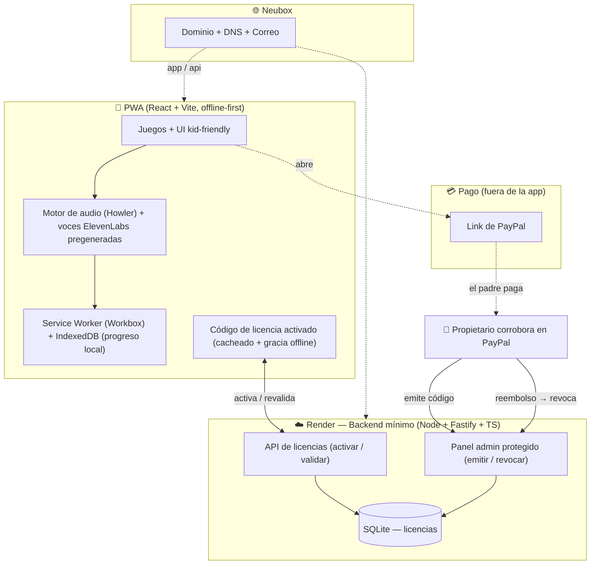
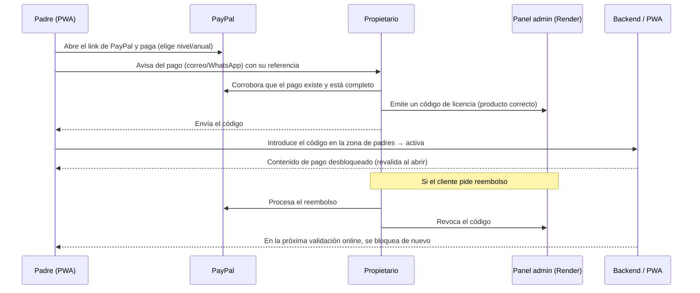

# Plan Maestro — AndreApp

> **App web (PWA) educativa e interactiva para niños de 0 a 5 años**, instalable en celulares y tabletas (iOS-first, no exclusiva). Inspirada en *Bimi Boo — Juegos para niños & niñas 2-5*, con la meta explícita de **superarla**: más currículo, mejor pedagogía, y diversión real.
>
> Este documento es el plan de producto + técnico + de negocio. La base pedagógica vive en [`docs/CURRICULUM.md`](docs/CURRICULUM.md) y es la fuente de verdad de qué se enseña y en qué orden.

**Decisiones ya confirmadas por el propietario:**
- Plataforma: **PWA** instalable (iOS-first, también Android/tablet).
- Monetización: **link de PayPal** (nada de integración de pagos ni Mercado Pago), **por nivel/etapa** o **licencia anual**. La licencia se **libera manualmente al corroborar el pago** y se **revoca si el cliente pide reembolso**.
- Audio: **ElevenLabs** (voces/sonidos) — se usa **una sola vez** para pregenerar los *assets*; la app no depende de ningún servicio en tiempo de ejecución.
- Idiomas: **Español (MX)** — etiqueta única "Español" + 🇲🇽 —, **Inglés**, **Português (Brasil)** 🇧🇷. *(La multi-idioma "i18n" es una **librería gratuita**, no una suscripción.)*
- Infraestructura: **solo lo que ya se tiene** — **Neubox** + **Render**. Sin servicios de pago adicionales.
- El agente asume **autonomía total** en decisiones técnicas; un **agente pedagógico** da feedback continuo.

---

## 1. Visión

Una PWA **offline-first, sin publicidad**, donde un niño de 0-5 aprende jugando a través de un currículo por niveles (ver `docs/CURRICULUM.md`), con **voz e íconos** (nada de texto para el niño), refuerzo positivo y cero castigo. Los padres pagan por un **link de PayPal**; tú **corroboras el pago y liberas la licencia** (un código que se activa en la app), y todo se gestiona desde una **zona de padres** protegida.

**Qué la hace mejor que la referencia** (resumen; detalle pedagógico en el currículo):
1. Currículo completo 0-5 (no solo números) y **adaptativo** (Zona de Desarrollo Próximo).
2. **Narrativa con personaje guía** → aprendizaje con sentido, no ejercicios sueltos.
3. **Nivel gratuito generoso** (sin muro de pago temprano) + compra por nivel o licencia anual.
4. **Localización real** (fonética es-MX / en / pt-BR), no traducción genérica.
5. **Panel de padres** con progreso pedagógico real.

---

## 2. Principios de diseño (producto)

Reglas duras para 0-5 (ver detalle en el currículo, §2):

| Principio | Implicación técnica |
|---|---|
| Audio + apoyo visual | Cada instrucción hablada se acompaña de **icono + demostración animada del gesto** (no "solo audio": excluiría a niños sordos). Texto solo en la zona de padres. |
| Botones grandes | Objetivos táctiles ≥ ~64 px, muy separados. |
| Gestos simples + alternativa | Solo *tocar* y *arrastrar lento*; **todo arrastre ofrece "tocar-tocar"** e **imán con radio de captura generoso**. Nunca multitáctil. |
| Sin castigo | El error nunca da sonido negativo ni bloquea; rebota suave y la pista sube de nivel. |
| Elogio de proceso | Acierto = animación + sonido + voz que felicita el **esfuerzo** ("¡lo intentaste!"), nunca el rasgo ("¡qué listo!"). Sin *loot*/recompensa aleatoria. |
| Sesiones saludables | Finales naturales, pausas activas y **límite de tiempo por defecto por edad**; la franja más pequeña, **uso acompañado** (ver §8). |
| Modo sensorial | Preset agrupado (menos animación + audio suave + ritmo lento) para perfiles neurodivergentes. |
| Zona de padres protegida | Candado para ajustes, compra y enlaces externos. |
| Privacidad primero | Sin datos del niño; sin analítica invasiva; el dinero lo maneja **PayPal** (no tocamos datos de pago). |

### Restricciones específicas de PWA en iOS (críticas)
Confirmadas en investigación; condicionan la arquitectura:
- **Audio solo tras gesto del usuario** → implementar "desbloqueo de audio" en el primer toque de cada sesión (Howler/WebAudio). Clips **cortos** (evitar el bloqueo de autoplay > ~1 min).
- **Instalación manual** ("Añadir a pantalla de inicio") → onboarding con instrucciones ilustradas para iOS.
- **Cuota de almacenamiento ajustada** → precargar solo el paquete de idioma/nivel activo; el resto bajo demanda con Service Worker.
- **Service Worker con límites** en iOS → offline confiable para *assets* cacheados; no depender de push para lógica de licencia.

---

## 3. Alcance del producto

El **catálogo de juegos = los 22 niveles** del currículo (`docs/CURRICULUM.md`, §4), con dos ejes transversales (🧠 función ejecutiva, ❤️ socioemocional). Agrupación para roadmap:

- **Etapa A — Descubrimiento** (N1-N3): causa-efecto, tocar objetivo, emparejar idénticos. *(gratis, uso acompañado)*
- **Etapa B — Exploración** (N4-N8): clasificar, vocabulario, rompecabezas, ❤️ emociones, 🧠 para y sigue. *(gratis parcial)*
- **Etapa C — Fundamentos** (N9-N16): subitizar, contar 1-5 y 6-10, formas/patrones, memoria, conciencia fonológica oral, seriar/secuencia temporal, trazado. *(de pago)*
- **Etapa D — Preescolar** (N17-N22): números 11-20 y comparar, sumar, 🧠 flexibilidad + 2 atributos, letras/fonética, trazar, lectura temprana. *(de pago)*

**Empaquetado comercial:**
- **Gratis:** Etapa A completa + una muestra de la B (para que el niño se enganche y el padre valore).
- **Compra por nivel/etapa:** desbloqueo granular (por etapa C o D, o por mundos).
- **Licencia anual:** acceso total durante 12 meses, todos los idiomas, futuras actualizaciones incluidas.

---

## 4. Arquitectura técnica

Monorepo con frontend PWA y un **backend mínimo de licencias** (sin cuentas, sin integración de pagos). El dinero se cobra fuera de la app con un **link de PayPal**.



### 4.1 Frontend (PWA)
- **React + Vite + TypeScript**, PWA con **Workbox** (manifest, offline, precache selectivo).
- **Escenas de juego:** DOM/SVG + **framer-motion** para la mayoría; **canvas (Konva/PixiJS)** para trazado y juegos con dibujo. *(Phaser opcional si algún mundo pide arcade.)*
- **Audio:** **Howler.js** (compatibilidad + desbloqueo iOS). Voces **ElevenLabs pregeneradas** por idioma como *assets* estáticos (no TTS en runtime → barato, offline y consistente).
- **Estado/persistencia:** **Zustand** + **IndexedDB** (localForage) para progreso offline.
- **i18n:** **react-i18next**, locales `es-MX`, `en`, `pt-BR`.
- **Licencia en cliente:** el padre introduce un **código de licencia** en la zona de padres → la app lo **activa** contra el backend y lo cachea. En cada apertura (con red) **revalida**; si fue **revocado o caducó**, bloquea el contenido de pago (con **periodo de gracia offline** de N días para no fastidiar sin conexión).

### 4.2 Backend mínimo (Render)
- **Node + Fastify + TypeScript**, **SQLite** (archivo en disco persistente de Render). *(No hace falta Postgres administrado ni cuentas de usuario: el modelo es por **código de licencia**, no por login.)*
- **Sin cuentas / sin PII:** no hay registro ni contraseñas; la licencia es un **código** ligado a lo comprado, no a una identidad.
- **API de licencias:** `POST /activar` (canjea un código y lo liga al dispositivo), `GET /validar` (estado vigente/revocado/caducado). Firma de respuestas para evitar manipulación.
- **Panel admin protegido** (solo el propietario): **emitir** códigos al corroborar un pago de PayPal (elige producto: nivel/etapa o anual), **revocar** ante reembolso, y ver el estado de cada licencia.
- **Sin integración de pagos:** el cobro ocurre en PayPal; el backend solo administra licencias. Nada de webhooks, PCI ni datos de tarjeta.

### 4.3 Infraestructura (Neubox + Render — lo que ya se tiene)
- **Neubox:** **dominio + DNS + correo** profesional (`hola@dominio`). *(Su hosting es cPanel/PHP y su VPS soporta Docker; no es ideal para un Node persistente, por eso el backend va en Render.)*
- **Render:** **backend mínimo de licencias** (web service + SQLite). El **frontend estático** puede ir en Render Static Site/CDN (o incluso en cPanel de Neubox).
- **DNS:** `app.<dominio>` → PWA, `api.<dominio>` → backend Render. TLS automático.
- **Secretos** (clave de firma de licencias, API key de ElevenLabs para generación) **solo en variables de entorno de Render**, nunca en el repo. El **link de PayPal** no es secreto.
- *Nota:* el plan gratuito de Render "duerme" el servicio; el **periodo de gracia offline** y la validación tolerante hacen que un arranque en frío no afecte la experiencia.

---

## 5. Flujo de pago, liberación y revocación

**Liberación 100% manual:** la licencia se activa **solo cuando el propietario corrobora el pago en PayPal**. Si hay **reembolso**, se **revoca**.



Detalles clave:
- **Corroboración manual:** el propietario confirma el pago **en PayPal** antes de emitir. Nada se libera solo.
- **Códigos de un solo uso:** cada código se liga al dispositivo al activarse; no se comparte entre muchos.
- **Revocación efectiva:** al revocar, la app bloquea el contenido de pago en la siguiente validación online (respetando la gracia offline).
- **Producto en el código:** el código codifica **qué** desbloquea (nivel/etapa o anual) y su **caducidad** (12 meses para la anual).
- **Sin datos de pago en nuestros sistemas:** todo el dinero y las tarjetas viven en PayPal.
- *(Opcional a futuro, si el volumen crece:* PayPal puede notificar automáticamente los pagos para pre-llenar el panel — **no** es necesario ahora y no cambia el modelo manual.*)*

---

## 6. Contenido y assets (ElevenLabs)

- **Voces por idioma** (es-MX cálida, en, pt-BR): instrucciones, números, nombres, frases de ánimo (con el nombre del niño si se configura). Se **pregeneran** con ElevenLabs mediante un **script versionado** (`scripts/gen-voices`), se revisan y se guardan como *assets* estáticos cacheados por el SW.
- **Efectos** (acierto, estrella, aplausos) y **música** suave con opción de silenciar.
- **Ilustraciones y animaciones** (personaje guía + celebraciones Lottie).
- ⚠️ **Licencias de assets:** todo con licencia clara para uso comercial. Voces ElevenLabs bajo su licencia comercial. Definir antes de la Fase 1.

---

## 7. Internacionalización

- Selector con **tres opciones**: **Español 🇲🇽** (etiqueta única "Español"), **English 🇺🇸**, **Português 🇧🇷**. *(La bandera de inglés es ajustable.)*
- Cada idioma tiene su **paquete de voces** y sus textos de la zona de padres.
- **Conciencia fonológica oral, letras y lectura (N14, N20, N22) rediseñados por idioma**, no traducidos (ver currículo §11): español silábico/CV, inglés opaco (rima + CVC, secuencia *s-a-t-p-i-n*), portugués con vocales nasales/dígrafos.
- **Revisión humana obligatoria** de los clips de **fonemas aislados** (ElevenLabs tiende a añadir "schwa"): no publicar sonidos de letras sin validarlos.
- Idioma persistente por dispositivo; cambiable desde la zona de padres.

---

## 8. Seguridad, privacidad y salud (app infantil)

- **Sin PII del niño** (a lo más, un nombre/apodo local para personalizar la voz, guardado en el dispositivo).
- **Tiempo de pantalla saludable** (OMS/AAP): **< ~18-24 m** solo uso acompañado; **2-5 años** hasta ~1 h/día con co-juego. **Límites por defecto por edad** en la zona de padres, con finales de sesión y pausas activas (ver currículo §8).
- **Zona de padres** con candado ante compras/ajustes/enlaces externos.
- Cumplimiento con la ley mexicana de datos (**LFPDPPP**) y buenas prácticas tipo **COPPA/GDPR-K** si se expande; **pagos y datos financieros** los procesa **PayPal** (nunca los tocamos).
- Analítica **mínima y respetuosa** (o nula en el MVP).
- Política de privacidad y términos publicados antes de cobrar.

---

## 9. Estructura del repositorio (propuesta)

```
AndreApp/
├─ apps/
│  ├─ web/                 # PWA (React + Vite): app/, juegos, motor de audio, i18n, SW
│  └─ api/                 # Backend mínimo (Fastify + SQLite): licencias, panel admin
├─ packages/
│  ├─ curriculum/          # Datos de los 22 niveles (config declarativa de cada juego)
│  ├─ shared/              # Tipos compartidos (licencias, DTOs)
│  └─ i18n/                # Cadenas + índice de paquetes de voz por idioma
├─ scripts/
│  └─ gen-voices/          # Generación de voces ElevenLabs (versionado)
├─ docs/
│  └─ CURRICULUM.md        # Fuente de verdad pedagógica
└─ PLAN.md                 # Este documento
```

---

## 10. Roadmap por fases

Estrategia: **validar la diversión y la pedagogía antes de cobrar.** Primero un MVP jugable y gratis; el pago llega cuando ya hay algo que valga la pena comprar.

| Fase | Entregable | Contenido |
|---|---|---|
| **0 · Fundaciones** | La PWA corre, instala y suena | Monorepo, PWA shell + manifest + SW offline, sistema de diseño kid-friendly, motor de audio con desbloqueo iOS, i18n base, store de progreso, pantalla de inicio con selector de mundos. |
| **1 · MVP jugable (gratis)** | 4-5 juegos en es-MX | Niveles **N1-N5** (Etapas A y B), voces ElevenLabs es-MX, progreso local, instalable, zona de padres básica. **Sin pagos aún.** Meta: ponerla en manos de Andre y medir enganche. |
| **2 · Currículo completo + idiomas** | Etapas C y D + en/pt-BR | Niveles **N6-N22** (incluye ejes 🧠 función ejecutiva y ❤️ socioemocional, subitización, conciencia fonológica oral), adaptividad (ZDP), trazado (canvas), fonética por idioma, paquetes de voz **en** y **pt-BR**. |
| **3 · Monetización (backend mínimo)** | Licencias por link de PayPal | **Backend de licencias en Render** (Fastify + SQLite, sin cuentas), **panel admin** para que emitas/revoques códigos, campo "introduce tu código" en la zona de padres, **link(s) de PayPal** por nivel/etapa y por licencia anual. Liberación y revocación **100% manuales**, tal como pediste. |
| **4 · Pulido y lanzamiento** | Listo para usuarios | Accesibilidad, música/animaciones finas, onboarding de instalación iOS, analítica respetuosa, términos/privacidad, dominio Neubox + despliegue productivo. |

**Sugerencia de secuencia mínima para ver valor pronto:** Fase 0 + Fase 1 (jugable con Andre) → luego decidir con datos reales antes de invertir en el resto del currículo y en el backend de licencias.

---

## 11. Métricas de éxito

- **Pedagógicas:** el niño progresa de nivel por **dominio** (no por edad) y transfiere aprendizajes fuera de la app.
- **De producto:** enganche (vuelve por gusto), sesiones sin frustración, tasa de finalización de rondas.
- **De negocio:** conversión de gratis→pago, renovación anual, reembolsos bajos.

---

## 12. Riesgos y mitigaciones

| Riesgo | Mitigación |
|---|---|
| Límites de PWA en iOS (audio, cuota, instalación) | Desbloqueo de audio por gesto, clips cortos, precarga selectiva, onboarding de instalación. |
| Compartir/filtrar un código de licencia | Código ligado al **dispositivo** al activarse (no reutilizable en otro); revocación inmediata si se detecta abuso. |
| Demora en liberar la licencia (proceso manual) | El padre ve un aviso claro de "pago recibido, activando tu acceso" tras pagar; el propietario recibe la notificación de PayPal al correo para responder rápido. |
| Neubox no corre Node persistente | Backend en Render; Neubox solo dominio/DNS/correo (VPS Docker opcional a futuro). |
| Costos/licencia de voces ElevenLabs | Pregenerar (no runtime), revisar licencia comercial, cachear. |
| Alcance grande | Fases; MVP gratis primero; currículo por niveles permite entregar por partes. |
| Contenido no apto por edad | Validación del **agente pedagógico** en cada fase (ver currículo §13). |

---

## 13. Lo que necesitaré del propietario (para fases con infra/pago)

*(No bloquea las Fases 0-2, que son 100% locales/sin cobro.)*
- **Dominio** deseado (para configurarlo en Neubox) y acceso a DNS.
- **Link(s) de PayPal** (o tu correo/`paypal.me` para generarlos) por producto: nivel/etapa y licencia anual.
- **API key de ElevenLabs** (para el script de generación de voces) — se carga como variable de entorno en Render, nunca en el repo.
- **Cuenta de Render** conectada al repo.
- **Precios** por nivel/etapa y de la licencia anual.
- **Contraseña/acceso** que quieras usar para el **panel admin** de licencias (emitir/revocar códigos).
- **Identidad de marca:** nombre y estilo del **personaje guía**, paleta y logo (o me das libertad para proponerlos).

---

## 14. Decisiones abiertas y feedback pedagógico

- **Bandera de inglés:** 🇺🇸 por defecto (ajustable a 🇬🇧 o globo neutro).
- **Sin cuentas de padres:** por diseño, no hay login ni contraseñas de usuario (menos fricción y menos datos que proteger); el acceso de pago se resuelve con el **código de licencia**, no con una identidad.
- **Motor de juego:** DOM/SVG + framer-motion por defecto; PixiJS/Phaser solo donde un mundo lo justifique.
- **Feedback del agente pedagógico:** se integra aquí y en `docs/CURRICULUM.md` en cada iteración. *(Ronda 1 **incorporada**: ejes de función ejecutiva y socioemocional, conciencia fonológica oral, sentido numérico corregido, tiempo de pantalla saludable, elogio de proceso e inclusión reforzada — ver `docs/CURRICULUM.md` §13.)*

---

## 15. Siguiente paso

Con el plan y el currículo validados por el especialista, arrancar la **Fase 0**: dejar la PWA corriendo (instalable, con audio y selector de mundos) y el primer juego **N1 · Causa y efecto** en español mexicano.
