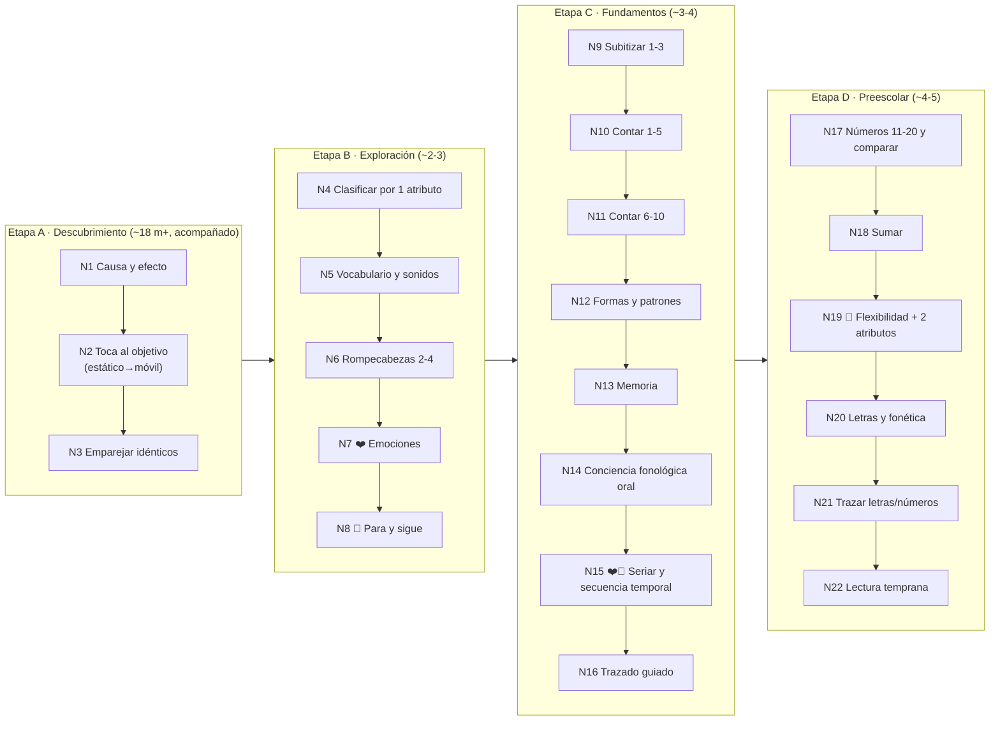

# Mapa Curricular — AndreApp

> **Rol:** documento redactado desde la perspectiva de un especialista en desarrollo infantil y pedagogía de 0 a 5 años.
> **Propósito:** definir el panorama de actividades y juegos **por niveles**, de lo más sencillo a lo más complejo, fundamentado en investigación de aprendizaje temprano, tomando la app de inspiración (*Bimi Boo — Juegos para niños & niñas 2-5*) como punto de partida a superar.
>
> **Estado:** incorpora la **1ª ronda de revisión del especialista en pedagogía** (ver §13). Cambios mayores: ejes de **función ejecutiva y socioemocional**, **conciencia fonológica oral** antes de la fonética, secuencia de **sentido numérico** corregida (subitización → 6-10 → comparar → sumar), postura de **tiempo de pantalla saludable** y **elogio de proceso**, e **inclusión** reforzada (redundancia visual, alternativa al arrastre, modo sensorial).

Este mapa es la **fuente de verdad pedagógica**. El plan técnico (`../PLAN.md`) se construye sobre él: cada nivel aquí descrito se convierte en uno o varios módulos de juego.

---

## 1. Filosofía y fundamentos

La app se apoya en marcos de aprendizaje temprano ampliamente validados:

| Marco | Qué aporta al diseño |
|---|---|
| **Piaget** (etapas sensoriomotora 0-2 y preoperacional 2-7) | El niño aprende **manipulando** y por **símbolos concretos**, no por explicaciones abstractas. Todo es tocable y visual. |
| **Vygotsky** (Zona de Desarrollo Próximo) | Cada actividad se sitúa un paso por encima de lo que el niño ya domina, con **andamiaje** (pistas graduales) que se retira conforme progresa. |
| **Función ejecutiva y autorregulación** (Diamond; Center on the Developing Child, Harvard) | El **control inhibitorio**, la **flexibilidad cognitiva** y la **memoria de trabajo** son los **predictores más fuertes** del éxito escolar 0-5, por encima de lo prenumérico/prealfabético. Se trabajan como **eje transversal**. |
| **Desarrollo socioemocional** | Reconocer y nombrar emociones, empatía y "primero-después" son parte esencial del desarrollo 0-5. Otro **eje transversal**. |
| **Montessori** | Materiales **sensoriales**, **autonomía** del niño, orden, y **"control del error"**: la actividad misma revela el acierto sin que un adulto corrija. |
| **Aprendizaje a través del juego** (LEGO Foundation / *Learning through Play*) | El juego debe ser **gozoso, con sentido, activo, iterativo y social**. Un juego "educativo" aburrido no enseña. |
| **Co-juego adulto-niño** (*joint media engagement*) | La evidencia sobre pantallas 0-5 recomienda **uso acompañado**. El pilar "social" se cumple diseñando actividades para **jugar junto a un adulto**, no en soledad. |
| **Hitos del desarrollo** (referencias tipo CDC/OMS) | Las expectativas motoras, cognitivas y de lenguaje se ajustan a la edad real; no se pide lo que el niño aún no puede hacer. |

**Principio rector:** *jugar es la forma en que los niños investigan el mundo.* La app no "da clase"; **provoca descubrimiento**, lo celebra e **invita al adulto a jugar con el niño**.

---

## 2. Cómo aprenden los niños de 0 a 5

El diseño de cada nivel respeta estas capacidades por edad (son orientativas: la app avanza por **dominio**, no por edad):

| Edad | Atención sostenida | Motricidad fina | Cognición | Lenguaje |
|---|---|---|---|---|
| **~18-24 m** (acompañado) | ~1-3 min | Toque impreciso, palma; sin arrastre fino | Causa-efecto, permanencia del objeto | Recibe vocabulario; primeras palabras |
| **2-3** | ~3-5 min | Toque puntual; arrastre lento e impreciso | Empareja idénticos; clasifica por 1 atributo; imita | Explosión de vocabulario; frases de 2-3 palabras |
| **3-4** | ~5-8 min | Arrastre con control; traza líneas | Subitiza 1-3; cuenta 1-5; secuencias simples | Sigue instrucciones de 2 pasos; rima |
| **4-5** | ~8-15 min | Traza formas/números; precisión creciente | Cuenta 1-20; compara y suma; patrones; cambia de regla | Reconoce letras y sonidos; narra |

**Implicaciones de diseño no negociables:**
- **Instrucción por audio + apoyo visual redundante**: cada indicación hablada se acompaña de **icono + demostración animada del gesto**. *(No "solo audio": eso excluiría a niños sordos o con hipoacusia.)* El texto solo aparece en la zona de padres.
- **Objetivos táctiles grandes** (≥ ~64 px) y bien separados.
- **Gestos simples**: solo *tocar* y *arrastrar lento*. Además, **todo arrastre ofrece alternativa "tocar origen → tocar destino"** y **imán con radio de captura generoso** (el arrastre-soltar puro es difícil e frustrante a los 2-3). Nunca multitáctil.
- **Sin castigo**: el error no produce sonido negativo ni bloquea; el objeto "rebota" suave y la pista sube de nivel.
- **Sesiones cortas con finales naturales** (saciedad) y **pausas activas**; la app **no depende de que el niño pare** (ver §8).
- **Franja más pequeña = experiencia acompañada.** Para ~18-24 meses la app se posiciona como juego **con un adulto**, no de uso en solitario (ver §8).

---

## 3. Ejes de aprendizaje

Dos tipos de contenido que se entrelazan:

- **Dominios de contenido:** vocabulario y lenguaje · sentido numérico · formas/espacio · lectura emergente (conciencia fonológica → letras) · motricidad/preescritura.
- **Ejes transversales** (recorren todas las etapas): **función ejecutiva/autorregulación** (control inhibitorio, flexibilidad cognitiva, memoria de trabajo) y **socioemocional** (emociones, empatía, secuencia "primero-después").

Los ejes transversales no son un "mundo" aparte: aparecen como niveles propios **y** como mecánicas dentro de otros.

---

## 4. El mapa por niveles

Progresión en **4 etapas** (A→D) y **22 niveles**, de lo más simple a lo más complejo. Cada nivel es un "mundo" temático con un personaje guía que da narrativa y sentido. Los íconos marcan el **eje transversal**: 🧠 función ejecutiva · ❤️ socioemocional.

### Tabla maestra

| # | Nivel | Objetivo pedagógico | Eje | Mecánica de juego |
|---|---|---|---|---|
| 1 | **Causa y efecto** | "Mis acciones producen resultados" (intencionalidad) | Atención | Tocar cualquier parte → animación + sonido + la voz nombra lo que apareció. Sin fallo posible. |
| 2 | **Toca al objetivo** | Dirigir la atención y apuntar | Atención | Personaje **primero estático** (solo "respira"), luego con movimiento que **escala de velocidad**; tocarlo → recompensa. |
| 3 | **Emparejar idénticos** | Emparejamiento por identidad (precursor de clasificar) | Percepción | Juntar dos objetos **iguales** (tocar-tocar o arrastre). |
| 4 | **Clasificar por 1 atributo** | Discriminar y categorizar | Categorización | Ordenar por color/forma/tamaño: primero **perceptual** (sin nombrar), luego **nombrado** (apoyado en el léxico de N5). |
| 5 | **Vocabulario y sonidos** | Comprensión auditiva y léxico | Lenguaje | "¿Dónde está el perro?" → tocar el correcto; escucha nombre + sonido. |
| 6 | **Rompecabezas 2-4 piezas** | Razonamiento espacial y persistencia | Espacial | Encajar siluetas grandes (control del error: solo entra la correcta; imán generoso). |
| 7 | **Emociones** | Reconocer y nombrar emociones (feliz/triste/enojado/asustado) | ❤️ | Emparejar cara ↔ emoción; "¿cómo se siente?"; historias "primero-después". |
| 8 | **Para y sigue** | Control inhibitorio (esperar la señal, go/no-go) | 🧠 | Bailar/moverse con la música y **congelarse** cuando para; tocar solo ante la señal correcta. Uno de los más divertidos. |
| 9 | **Subitizar 1-3** | Reconocer cantidades pequeñas **sin contar** | Número | Aparecen 1-3 objetos un instante; elegir cuántos había. |
| 10 | **Contar 1-5** | Correspondencia uno a uno y cardinalidad | Número | Contar tocando (un toque = un objeto = un número dicho). |
| 11 | **Contar 6-10** | Extender el conteo | Número | Igual que N10 con conjuntos 6-10; cuidar nombres irregulares por idioma. |
| 12 | **Formas y patrones** | Reconocer formas y completar patrones ABAB | Formas | Emparejar formas; completar "🔴🔵🔴🔵__". |
| 13 | **Memoria** | Memoria de trabajo | 🧠 | Memorama con techo **adaptativo por edad** (2-3 pares a los 3 → hasta 6 a los 5). |
| 14 | **Conciencia fonológica oral** | Rima, sílabas y aliteración **sin letras** | Lenguaje | Juegos auditivos: "¿cuál rima?", aplaudir sílabas, "¿con qué sonido empieza?". **Rediseñado por idioma.** |
| 15 | **Seriar y secuencia temporal** | Ordenar por tamaño; "primero-después" | ❤️🧠 | Ordenar de pequeño a grande; ordenar una rutina (mañana→noche). |
| 16 | **Trazado guiado** | Preescritura y control motor fino | Motriz | Seguir líneas/formas guiadas. **Éxito por esfuerzo/participación, no por precisión** (la guía se atenúa con el dominio). |
| 17 | **Números 11-20 y comparar** | Contar hasta 20; "¿cuál tiene más?" | Número | Conteo a 20; comparación de cantidades. |
| 18 | **Sumar** | Combinar conjuntos (suma de 1 dígito con apoyo visual) | Número | Juntar dos grupos de objetos y contar el total. |
| 19 | **Flexibilidad + 2 atributos** | Cambiar de regla; clasificar por 2 atributos | 🧠 | Clasificar por color y **luego cambiar la regla** a forma; ordenar por 2 atributos. |
| 20 | **Letras y fonética** | Asociación letra-sonido | Lenguaje | Reconocer la letra, su **sonido** (no su nombre) y una palabra que empieza así. **Rediseñado por idioma.** |
| 21 | **Trazar letras y números** | Escritura emergente | Motriz | Trazar números y letras siguiendo la guía animada (éxito por esfuerzo). |
| 22 | **Lectura temprana** | Asociación palabra-imagen y sílabas simples | Lenguaje | Emparejar palabra ↔ imagen; formar sílabas CV por audio. **Rediseñado por idioma.** |

---

## 5. Fichas de niveles clave

Ejemplos del detalle que cada módulo debe cumplir (los 22 se documentan igual en implementación):

**N1 — Causa y efecto** · *Meta:* entender que tocar produce algo maravilloso. *Éxito:* toca y repite (no hay "correcto/incorrecto"). *Andamiaje:* si no toca en ~5 s, un brillo invita. *Mejora sobre la referencia:* primero **intención y confianza**, no números.

**N8 — Para y sigue (control inhibitorio)** · *Meta:* inhibir la respuesta dominante (parar cuando la música se detiene). *Éxito:* se congela en 3 señales seguidas. *Por qué importa:* la función ejecutiva predice el éxito escolar mejor que lo prenumérico. *Diversión:* es de los juegos más gozosos de la edad (baile + sorpresa).

**N9 — Subitizar 1-3** · *Meta:* "ver" la cantidad sin contar (base de la cardinalidad). *Andamiaje:* exposición breve → si duda, se permite contar. *Precede a N10.*

**N14 — Conciencia fonológica oral** · *Meta:* jugar con los sonidos del habla **antes** de las letras (predictor #1 de la lectura). *Clave:* es **auditivo, sin letras**, y **distinto por idioma** (ver §11).

**N16 / N21 — Trazado** · *Meta:* control motor y memoria del trazo. *Éxito:* **por intentar el trazo completo**, no por exactitud; la guía se atenúa con el dominio.

---

## 6. Progresión y adaptividad

- **Desbloqueo por dominio, no por edad:** un nivel se abre al dominar el anterior (p. ej. 3 rondas con ≥80% de acierto sin pista). El adulto puede fijar la edad como punto de entrada sugerido.
- **La maestría no es un examen:** los mundos ya vistos quedan **siempre disponibles para juego libre**; el "candado por dominio" es una **sugerencia** de la app, no una barrera que frustre al que quiere repetir.
- **Andamiaje dinámico (ZDP):** tras 2 fallos la pista sube (resalte → voz → demostración), con **desvanecimiento fiable** y **variación del tipo de pista** para evitar que el niño "espere la demo". De vez en cuando se pide un intento independiente antes de volver a la ayuda máxima.
- **Repetición con variación:** el mismo objetivo reaparece en distintos contextos/temas (*práctica espaciada*) para consolidar sin aburrir.

---

## 7. Recompensas (motivación intrínseca)

La investigación advierte contra premios extrínsecos que apagan el interés (efecto de sobrejustificación; Deci, Lepper). Por eso:
- **Elogio de proceso, no de rasgo** (Dweck): la voz dice *"¡lo intentaste muchísimo!"*, *"¡lo lograste tú solo!"* — **nunca** *"¡qué inteligente!"*.
- **Celebración del logro** (animación + sonido + felicitación por su nombre).
- **Coleccionables de baja prominencia y narrativos** ("descubriste un nuevo amigo del bosque"), no trofeos ni contadores de "te faltan 3".
- **Prohibido** todo mecanismo de **recompensa variable/aleatoria** (cajas sorpresa, ruletas, *loot*): son adictivos por diseño e inapropiados para menores.
- **Nada de rankings, vidas ni "game over".** Sin presión ni pérdida.
- **Progreso visible** como un mapa que se ilumina (sentido de avance).

---

## 8. Tiempo de pantalla saludable

Postura explícita del producto (OMS / AAP), un diferenciador honesto frente a la referencia:
- **< ~18-24 meses:** desaconsejado el uso en solitario; la app se usa **solo acompañada** por un adulto (o nada). La Etapa A se comunica como **experiencia conjunta**.
- **2-5 años:** hasta **~1 hora/día** de contenido de calidad, preferentemente **con co-visionado/co-juego**.
- **Límites de tiempo por defecto por edad** en la zona de padres (no solo un control opcional), con aviso amable de descanso.
- **Finales de sesión naturales** y **pausas activas** ("levántate y salta 3 veces con el personaje") — que además entrenan autorregulación.
- La app **educa al padre** sobre co-juego y descansos, sin culpabilizar.

---

## 9. Accesibilidad e inclusión

Base: no depender solo del color (formas/íconos redundantes), objetivos grandes y tolerantes, volumen/música ajustables, opción de reducir animaciones, sin destellos ni sonidos estridentes.

Refuerzos por perfil:
- **Sordera / hipoacusia:** toda instrucción por voz tiene **redundancia visual** (icono + demostración animada del gesto). *(De ahí "audio + apoyo visual", nunca "solo audio".)*
- **Neurodivergencia (autismo, TDAH):** **predictibilidad** (previsualización "primero-después", rutinas consistentes), sin sonidos fuertes inesperados. **Modo sensorial suave** (preset agrupado: menos animación + audio más bajo y espaciado + ritmo más lento) frente a un modo más rico, para niños hiper- e hiporreactivos. Sesiones cortas, trozos pequeños y pausas de movimiento.
- **Motricidad atípica:** un solo toque (nunca multitáctil), **alternativa tocar-tocar** al arrastre, radios de acierto generosos, y considerar **selección por permanencia (dwell)**.
- **Zona de padres (única parte con texto):** contraste y tamaño de fuente ajustables, compatible con lector de pantalla.

---

## 10. Rol de los padres

- **Zona de padres protegida** (candado con gesto/operación simple) — nunca accesible por accidente para el niño.
- **Panel** con: dominios y ejes trabajados, nivel alcanzado por área, tiempo de uso, y **sugerencias** ("Andre domina contar hasta 5; probemos formas").
- **Invitaciones a co-jugar** ("este nivel es más rico si lo juegan juntos").
- **Controles**: **límite de tiempo por defecto según edad**, idioma, música, modo sensorial, y compra/licencia.

---

## 11. Localización pedagógica (por idioma, no traducción)

Cada idioma tiene su **fonética y su realidad cultural**; los niveles de sonidos/letras/lectura (N14, N20, N22) se **rediseñan**, no se traducen.

- **Español (México) 🇲🇽** — etiqueta única "Español". Ortografía **transparente**: ruta **silábica (CV)** natural, empezar por las **5 vocales puras**, enseñar el **sonido** (no el nombre de la letra), cuidar dígrafos (ch, ll, rr) y la ñ, evitar el "schwa" al aislar consonantes. Voz cálida neutra-mexicana.
- **Inglés 🇺🇸** — ortografía **opaca**: **NO** replicar la ruta silábica del español. Más **conciencia fonémica**, distinguir **nombre vs sonido** de la letra, vocales cortas, palabras **CVC** (cat), mucha **rima / onset-rime**, e introducir letras por **utilidad fonética** (secuencia tipo *s-a-t-p-i-n*), no alfabéticamente.
- **Português (Brasil) 🇧🇷** — silábico con más complejidad vocálica: **vocales nasales** (ã, õ), abiertas/cerradas, dígrafos (nh, lh, ch, rr) y diacríticos; pronunciación regional consistente.
- **Transversal:** la **conciencia fonológica oral** (N14) es específica de cada idioma y precede a las letras en todos.
- **Riesgo del audio pregenerado (ElevenLabs):** aislar **fonemas** limpiamente es difícil para un TTS (tiende a añadir schwa: "buh" por /b/). Para N14/N20/N22, **revisión humana obligatoria** de cada clip de sonido aislado.
- **Realia cultural:** objetos, animales y alimentos familiares por locale, no genéricos.

---

## 12. Qué mejora frente a la app de inspiración

| Aspecto | Bimi Boo (referencia) | AndreApp (propuesta) |
|---|---|---|
| Alcance | Foco casi único en números 1-20 | **Currículo completo** 0-5: 22 niveles, dominios + **ejes de función ejecutiva y socioemocional** |
| Progresión | Lineal por número | **Por dominio + adaptividad (ZDP)**, con juego libre siempre disponible |
| Entrada | Empieza en abstracto (números) | Empieza en **causa-efecto** y construye confianza |
| Lectura | Salta a letras | **Conciencia fonológica oral primero** (predictor #1) |
| Sentido | Actividades sueltas | **Narrativa con personaje guía** + **co-juego con el adulto** |
| Salud | Sin postura | **Tiempo de pantalla saludable** y elogio de proceso explícitos |
| Inclusión | Limitada | **Redundancia visual, alternativa al arrastre, modo sensorial** |
| Cultura | Traducción genérica | **Localización real** (fonética es-MX / en / pt-BR) |
| Acceso | Muro de pago temprano | **Nivel gratuito generoso**; el pago desbloquea profundidad, no lo básico |

---

## 13. Feedback del especialista (ciclo continuo)

**Ronda 1 (incorporada en esta versión).** El especialista validó la columna vertebral (causa-efecto primero, control del error, sin castigo, progresión por dominio, ZDP, rediseño por idioma) y señaló mejoras que ya se aplicaron:
1. Nuevos **ejes de función ejecutiva y socioemocional** (N7 emociones, N8 para/sigue, N15 secuencia temporal, N19 flexibilidad) + co-juego como pilar "social".
2. **Conciencia fonológica oral** (N14) antes de la fonética (N20).
3. Sentido numérico reparado: **subitización** (N9), **6-10** (N11) y **N10 partido** en contar/comparar/sumar (N10, N17, N18).
4. **Tiempo de pantalla saludable** (§8), **elogio de proceso** (§7) y reencuadre del "0" como uso acompañado.
5. **Inclusión**: "audio + apoyo visual" (no solo audio), **alternativa al arrastre**, **modo sensorial** (§2, §9).

Cada iteración futura del plan y del producto se revisa igual con el agente pedagógico; las observaciones se registran aquí y en `../PLAN.md`.
