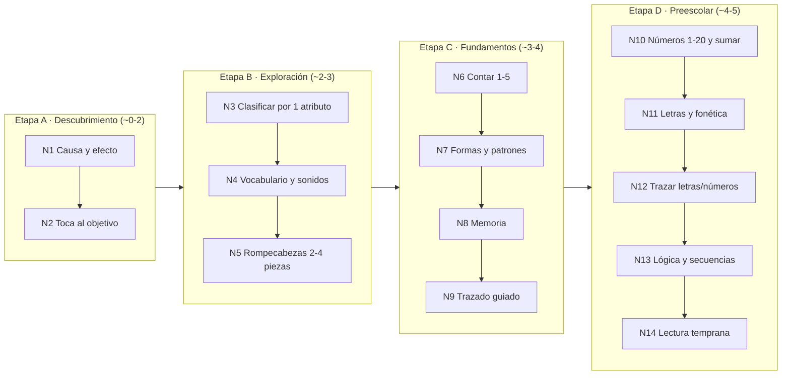

# Mapa Curricular — AndreApp

> **Rol:** documento redactado desde la perspectiva de un especialista en desarrollo infantil y pedagogía de 0 a 5 años.
> **Propósito:** definir el panorama de actividades y juegos **por niveles**, de lo más sencillo a lo más complejo, fundamentado en investigación de aprendizaje temprano, tomando la app de inspiración (*Bimi Boo — Juegos para niños & niñas 2-5*) como punto de partida a superar.

Este mapa es la **fuente de verdad pedagógica**. El plan técnico (`../PLAN.md`) se construye sobre él: cada nivel aquí descrito se convierte en uno o varios módulos de juego.

---

## 1. Filosofía y fundamentos

La app se apoya en marcos de aprendizaje temprano ampliamente validados:

| Marco | Qué aporta al diseño |
|---|---|
| **Piaget** (etapas sensoriomotora 0-2 y preoperacional 2-7) | El niño aprende **manipulando** y por **símbolos concretos**, no por explicaciones abstractas. Todo es tocable y visual. |
| **Vygotsky** (Zona de Desarrollo Próximo) | Cada actividad se sitúa un paso por encima de lo que el niño ya domina, con **andamiaje** (pistas graduales) que se retira conforme progresa. |
| **Montessori** | Materiales **sensoriales**, **autonomía** del niño, orden, y **"control del error"**: la actividad misma revela el acierto sin que un adulto corrija. |
| **Aprendizaje a través del juego** (LEGO Foundation / *Learning through Play*) | El juego debe ser **gozoso, con sentido, activo, iterativo y social**. Un juego "educativo" aburrido no enseña. |
| **Hitos del desarrollo** (referencias tipo CDC/OMS) | Las expectativas motoras, cognitivas y de lenguaje se ajustan a la edad real; no se pide lo que el niño aún no puede hacer. |

**Principio rector:** *jugar es la forma en que los niños investigan el mundo.* La app no "da clase"; **provoca descubrimiento** y lo celebra.

---

## 2. Cómo aprenden los niños de 0 a 5

El diseño de cada nivel respeta estas capacidades por edad (son orientativas: la app avanza por **dominio**, no por edad):

| Edad | Atención sostenida | Motricidad fina | Cognición | Lenguaje |
|---|---|---|---|---|
| **0-2** | ~1-3 min | Toque impreciso, palma; sin arrastre fino | Causa-efecto, permanencia del objeto | Recibe vocabulario; primeras palabras |
| **2-3** | ~3-5 min | Toque puntual; arrastre lento | Clasifica por 1 atributo; imita | Explosión de vocabulario; frases de 2-3 palabras |
| **3-4** | ~5-8 min | Arrastre con control; traza líneas | Cuenta 1-5; secuencias simples | Sigue instrucciones de 2 pasos |
| **4-5** | ~8-15 min | Traza formas/números; precisión creciente | Cuenta 1-20; compara cantidades; patrones | Reconoce letras y sonidos; narra |

**Implicaciones de diseño no negociables:**
- **Sin texto para el niño**: toda instrucción es por **voz + íconos**.
- **Objetivos táctiles grandes** (≥ ~64 px) y bien separados.
- **Gestos simples**: solo *tocar* y *arrastrar lento*. Nada de doble toque, swipe preciso ni pellizco.
- **Sin castigo**: el error no produce sonido negativo ni bloquea; se repite la pista con más apoyo.
- **Sesiones cortas** con celebración frecuente; sin cronómetros que presionen.

---

## 3. El mapa por niveles

Progresión en **4 etapas** (A→D) y **14 niveles**, de lo más simple a lo más complejo. Cada nivel es un "mundo" temático con un personaje guía que da narrativa y sentido.

### Tabla maestra

| # | Nivel | Objetivo pedagógico | Habilidades (cognitiva / motora / lenguaje) | Mecánica de juego |
|---|---|---|---|---|
| 1 | **Causa y efecto** | Descubrir que "mis acciones producen resultados" (intencionalidad) | Atención · toque · exposición a vocabulario | Tocar cualquier parte → animación + sonido + la voz nombra lo que apareció. Sin fallo posible. |
| 2 | **Toca al objetivo** | Dirigir la atención y apuntar | Atención sostenida · puntería · vocabulario receptivo | Un personaje aparece y se mueve suave; tocarlo → recompensa. |
| 3 | **Clasificar por 1 atributo** | Discriminar y categorizar (color, forma o tamaño) | Categorización · arrastre · nombres de atributos | Arrastrar objetos a la caja del color/forma correcta. |
| 4 | **Vocabulario y sonidos** | Comprensión auditiva y ampliación de léxico | Escucha · toque · lenguaje receptivo | "¿Dónde está el perro?" → tocar el correcto; escucha nombre + sonido. |
| 5 | **Rompecabezas 2-4 piezas** | Razonamiento espacial y persistencia | Percepción espacial · arrastre con control | Encajar siluetas/piezas grandes en su hueco (control del error: solo entra la correcta). |
| 6 | **Contar 1-5** | Correspondencia uno a uno y cardinalidad | Conteo · toque · números hablados | Contar objetos que aparecen uno a uno; tocar el número o la cantidad correcta. |
| 7 | **Formas y patrones** | Reconocer formas y completar patrones ABAB | Reconocimiento · secuenciación · arrastre | Emparejar formas; completar el patrón "🔴🔵🔴🔵__". |
| 8 | **Memoria** | Memoria de trabajo | Memoria · toque | Memorama de 2→6 pares (según dominio). |
| 9 | **Trazado guiado** | Preescritura y control motor fino | Coordinación óculo-manual · trazo | Seguir con el dedo líneas y formas guiadas (canvas); la voz acompaña. |
| 10 | **Números 1-20 y sumar** | Sentido numérico; comparar cantidades; sumas de 1 dígito con apoyo | Conteo avanzado · comparación · toque | Contar hasta 20; "¿cuál tiene más?"; sumar con objetos visuales. |
| 11 | **Letras y fonética** | Conciencia fonológica y reconocimiento de letras | Asociación letra-sonido · escucha | Reconocer la letra, su **sonido** y una palabra que empieza con ella (fonética adaptada al idioma). |
| 12 | **Trazar letras y números** | Escritura emergente | Trazo preciso · secuencia de trazos | Trazar números y letras siguiendo la guía animada. |
| 13 | **Lógica y secuencias** | Ordenar, seriar y clasificar por 2 atributos | Razonamiento lógico · arrastre | Ordenar por tamaño; secuencia de una rutina (mañana→noche); clasificar por color **y** forma. |
| 14 | **Lectura temprana** | Asociación palabra-imagen y sílabas simples | Decodificación inicial · escucha | Emparejar palabra con imagen; formar sílabas simples (CV) por audio. |

---

## 4. Fichas de los niveles clave

Ejemplos del detalle que cada módulo debe cumplir (los 14 se documentan igual en implementación):

**Nivel 1 — Causa y efecto**
- *Meta:* el bebé/niño entiende que tocar produce algo maravilloso.
- *Éxito:* toca repetidamente y sonríe/repite (no hay "correcto/incorrecto").
- *Andamiaje:* si no toca en ~5 s, un brillo invita a tocar.
- *Mejora sobre la referencia:* la app de inspiración arranca directo en números; aquí primero se construye **intención y confianza**.

**Nivel 6 — Contar 1-5**
- *Meta:* correspondencia uno a uno (un toque = un objeto = un número dicho).
- *Éxito:* cuenta 3 conjuntos seguidos sin ayuda.
- *Andamiaje:* nivel 1 la voz cuenta con el niño; nivel 2 el niño cuenta solo; nivel 3 elige el número sin conteo guiado.
- *Control del error:* al tocar de más, el objeto "rebota" suave sin sonido negativo.

**Nivel 9 / 12 — Trazado**
- *Meta:* control motor fino y memoria del trazo (secuencia correcta de un número/letra).
- *Éxito:* completa el trazo dentro de la guía en 2 intentos.
- *Andamiaje:* punto de inicio parpadeante + flecha; la guía se hace más tenue conforme domina.

---

## 5. Progresión y adaptividad

- **Desbloqueo por dominio, no por edad:** un nivel se abre cuando el anterior se domina (p. ej. 3 rondas con ≥80% de acierto sin pista). El adulto puede fijar la edad para sugerir un punto de entrada.
- **Andamiaje dinámico (ZDP):** si el niño falla 2 veces, la pista sube de nivel (resalte → voz → demostración). Si acierta rápido, la dificultad sube (más elementos, menos pistas).
- **Repetición con variación:** el mismo objetivo (p. ej. "contar 3") reaparece con distintos contextos/temas para consolidar sin aburrir (*práctica espaciada*).
- **Sin caminos únicos:** el niño elige el mundo; dentro de él, la app gradúa.

---

## 6. Sistema de recompensas (motivación intrínseca)

La investigación advierte contra premios extrínsecos que apagan el interés. Por eso:
- **Celebración del logro** (animación, aplauso, la voz felicita por su nombre).
- **Colección de calcomanías/personajes** que se ganan al dominar, no por competir.
- **Nada de rankings, vidas, ni "game over".** No hay presión ni pérdida.
- **Progreso visible para el niño** como un mapa que se ilumina (sentido de avance).

---

## 7. Qué mejora frente a la app de inspiración

| Aspecto | Bimi Boo (referencia) | AndreApp (propuesta) |
|---|---|---|
| Alcance | Foco casi único en números 1-20 | **Currículo completo** 0-5 (14 niveles, 4 dominios) |
| Progresión | Lineal por número | **Por dominio + adaptividad (ZDP)** |
| Entrada | Empieza en abstracto (números) | Empieza en **causa-efecto** y construye confianza |
| Sentido | Actividades sueltas | **Narrativa con personaje guía** (aprendizaje con significado) |
| Adulto | Poca información | **Panel de padres** con progreso real por dominio |
| Cultura | Traducción genérica | **Localización real** (fonética es-MX / en / pt-BR) |
| Acceso | Muro de pago temprano (num. 1-3 gratis) | **Nivel gratuito generoso**; el pago desbloquea profundidad, no lo básico |

---

## 8. Accesibilidad e inclusión

- **No depender solo del color** (formas/íconos redundantes) → apto para daltonismo.
- **Todo por audio** → apto para prelectores y para acompañar a niños con dificultades visuales.
- **Objetivos grandes y tolerantes** → apto para motricidad en desarrollo o atípica.
- **Volumen y música ajustables**; opción de reducir animaciones (sensibilidad sensorial).
- **Sin destellos bruscos** ni sonidos estridentes.

---

## 9. Rol de los padres

- **Zona de padres protegida** (candado con gesto/operación simple) — nunca accesible por accidente para el niño.
- **Panel** con: dominios trabajados, nivel alcanzado por área, tiempo de uso, y **sugerencias** ("Andre domina contar hasta 5; probemos formas").
- **Controles**: límite de tiempo, idioma, música, y compra/licencia.

---

## 10. Localización cultural (pedagógica)

No es traducir: cada idioma tiene su **fonética y su realidad cultural**.
- **Español (México) 🇲🇽** — etiqueta única "Español". Fonética y vocabulario mexicano; voz neutra-mexicana cálida.
- **Inglés** — fonética y nombres en inglés; el juego de letras usa el alfabeto y sonidos del inglés (no es el español traducido).
- **Português (Brasil) 🇧🇷** — fonética y vocabulario brasileños.

Los niveles de **letras/fonética y lectura (11, 14)** se **rediseñan por idioma**, no se traducen. El resto (números, formas, memoria) se localiza en voz y texto de apoyo del adulto.

---

## 11. Feedback del especialista (ciclo continuo)

Este mapa se revisa con un **agente experto en pedagogía** en cada iteración del plan y del producto: valida que cada juego respete la etapa de desarrollo, el andamiaje y la ausencia de castigo, y propone mejoras. Las observaciones se registran en `../PLAN.md` (sección de decisiones) y aquí.
